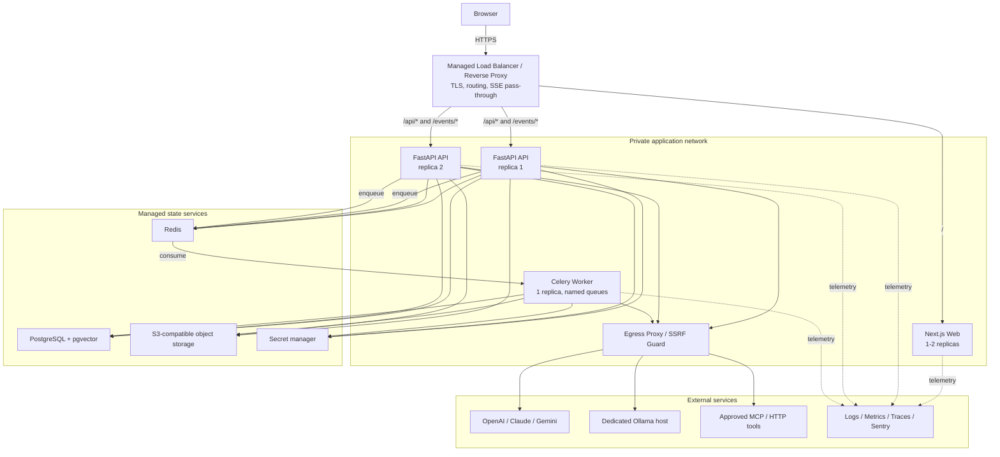
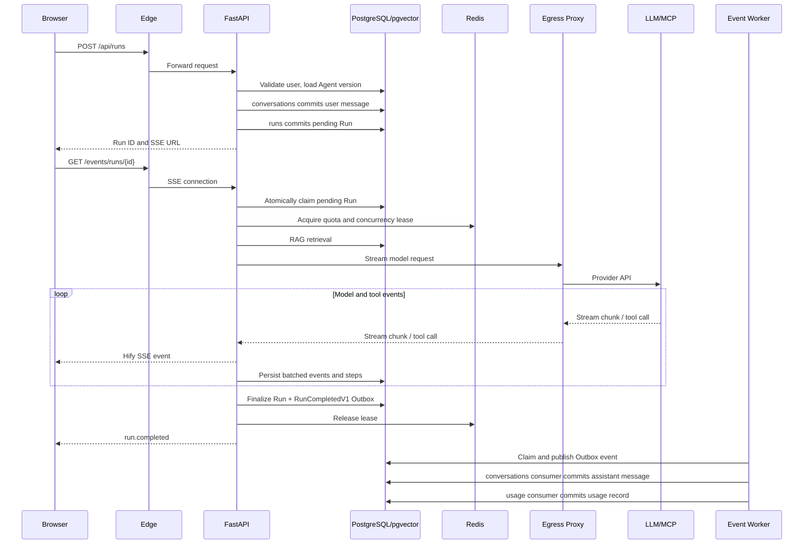
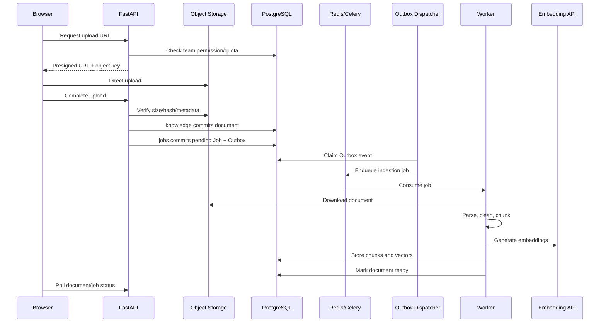

# Hify 一期部署架构

本文定义 Hify 在 50-100 名团队用户阶段的生产部署架构。目标是在单人可维护的前提下支持无停机发布、故障隔离和后续水平扩容。

## 1. 部署决策

一期采用容器化应用服务和托管状态服务：

- 使用普通容器平台、PaaS 或云容器服务，禁止一期引入 Kubernetes。
- `web`、`api` 和 `worker` 使用同一 Monorepo 构建为独立镜像。
- PostgreSQL、Redis 和对象存储优先使用托管服务，不与应用容器部署在同一主机。
- API 保持无状态；任何 API 副本都能处理普通请求和创建新的 Agent Run。
- 交互式 Agent Run 在 API 内异步执行并通过 SSE 返回，不经过 Celery。
- 文档解析、Embedding、批量生成和维护任务通过 Redis 交给 Celery Worker。
- Ollama 部署在独立推理节点或使用外部 Ollama 服务，禁止与 API/Worker 共享计算资源。
- 对外只开放 HTTPS 443；数据库、Redis、Worker 和 Ollama 不开放公网访问。

## 2. 总体拓扑



## 3. 组件与职责

### 3.1 Load Balancer / Reverse Proxy

职责：

- 终止 TLS，强制 HTTP 跳转 HTTPS。
- `/` 路由到 Next.js；`/api/*` 和 `/events/*` 直接路由到 FastAPI。
- 对 API 副本执行负载均衡和健康检查。
- 保持 SSE 连接，不缓存、不缓冲流式响应。
- 提供基础请求大小限制、连接数限制和访问日志。

必须配置：

```text
SSE response buffering: off
SSE compression buffering: off
idle timeout: 700s
request body limit: 10 MiB
upload path: no large file body; use presigned S3 upload
X-Forwarded-Proto / Host / For: preserved
```

不得让 Next.js 代理 SSE；浏览器在同一域名下直接连接 FastAPI，减少一层缓冲和断线点。

### 3.2 Next.js Web

职责：

- 页面渲染、前端路由和静态资源。
- Agent 配置、对话、知识库、模型和管理后台 UI。
- 使用生成的 TypeScript Client 调用 FastAPI。
- 消费 Hify SSE 事件并更新 UI。
- 只保存短期界面状态，不保存业务真相。

禁止：

- 直接访问 PostgreSQL、Redis 或模型供应商。
- 持有模型 API Key。
- 执行 Agent、RAG、权限或额度逻辑。

一期运行 1 个副本；要求滚动发布无中断时运行 2 个副本。静态资源使用对象存储/CDN属于可选优化，不是一期必需组件。

### 3.3 FastAPI API

职责：

- 登录会话、身份认证、权限和团队隔离。
- Agent、模型提供商、知识库、工作流、MCP 和工具的管理 API。
- 创建 Run、执行交互式 Agent、编排 RAG/LLM/工具调用。
- SSE 流式输出、取消传播、超时、重试、熔断和模型回退。
- 创建后台 Job 记录并向 Celery 投递任务。
- 生成对象存储 Presigned Upload/Download URL。

一期运行 2 个副本，每个容器运行 1 个 Uvicorn Worker。每个副本拥有自己的异步 SDK Client Pool 和本地 Bulkhead；Redis 负责跨副本限流和熔断状态。

API 必须无状态：

- 会话和业务状态进入 PostgreSQL。
- 限流、短期缓存、Celery Broker 和熔断状态进入 Redis。
- 文件进入 S3。
- 禁止依赖本地磁盘保存上传文件、Checkpoint 或用户会话。

### 3.4 Celery Worker

职责：

- `ingestion`：下载、解析、清洗和切分文档。
- `embedding`：调用 Embedding API 并写入 pgvector。
- `llm_batch`：非交互式批量模型调用。
- `events`：Transactional Outbox 发布和集成事件消费。
- `maintenance`：清理、统计、Job 对账和失败恢复。

一期使用 1 个 Worker Deployment、Prefork Concurrency 4，并消费五个命名队列。`worker_prefetch_multiplier=1`。

Worker 不负责：

- 浏览器 SSE。
- 交互式 Agent Loop。
- 用户点击停止后的低延迟取消。

扩容时先按队列拆为 `worker-ingestion` 和 `worker-llm`，不修改业务模块。

### 3.5 PostgreSQL + pgvector

职责：

- 用户、团队、Agent、工作流、会话、消息和 Run 的业务数据。
- `jobs` 模块拥有的 Job、共享消息基础设施拥有的 Outbox/Inbox、用量和审计记录。
- 知识库元数据、Chunk 和向量索引。
- LangGraph 所需的 Hify 自有 Run State；禁止把 LangGraph 内部对象作为主业务模型。

一期建议起始规格：2 vCPU、4-8 GiB 内存、50 GiB SSD、自动扩容存储。必须启用：

- 自动备份和至少 7 天 Point-in-Time Recovery。
- TLS 和私网访问。
- `pgvector` 扩展。
- 慢查询日志。
- 最大连接数至少 100。

SQLAlchemy 初始连接池：每个 API 副本 `pool_size=10, max_overflow=10`，Worker `pool_size=5, max_overflow=5`。总连接预算不得超过数据库上限的 70%。一期不需要读副本和独立向量数据库。

### 3.6 Redis

职责：

- Celery Broker 和任务结果的短期状态。
- RPM/TPM Token Bucket、分布式并发租约和熔断状态。
- 短期缓存和幂等键。
- 可选的短期 SSE 事件转发，不作为永久 Run 记录。

必须使用独立命名空间或 Key Prefix 区分 `celery`、`rate_limit`、`circuit` 和 `cache`。开启认证、TLS 和内存上限。一期不使用通用 Redis Cache，所有运行控制 Key 必须有 TTL，并采用 `noeviction`，避免静默淘汰 Celery Broker 数据。

任务真相存放在 PostgreSQL 的 Job 表中。Redis 数据丢失后，Reconciler 根据 Job 表重新投递未完成的幂等任务。

### 3.7 S3-compatible Object Storage

职责：

- 用户上传的原始文档。
- 文档解析中间产物和可选导出文件。
- 大文件直接上传，避免经过 API 容器。

上传流程必须使用短时 Presigned URL：

- URL 有效期 10 分钟。
- Key 由服务端生成，包含 Team ID 和随机 UUID。
- 限制 MIME、扩展名和最大文件大小。
- 上传完成后由 API 校验对象大小和 Hash，再创建解析 Job。
- Bucket 禁止公开访问，下载也使用短时授权 URL。

### 3.8 Egress Proxy / SSRF Guard

用户可以配置 HTTP/MCP 地址，因此必须建立出站安全边界。

职责：

- 允许访问已配置的模型供应商域名和管理员批准的 MCP/HTTP Tool。
- 拒绝 Loopback、Link-local、云元数据地址和未授权私网网段。
- DNS 解析后再次验证目标 IP，防止 DNS Rebinding。
- 记录域名、端口、耗时和结果，不记录凭证和正文。
- 限制目标端口、重定向次数、响应大小和连接时间。

Ollama 或内部 MCP 如需访问私网，必须配置精确 Host/IP Allowlist，禁止开放整个 RFC1918 网段。

### 3.9 Ollama Host

职责仅限模型推理和模型文件管理。它必须：

- 部署在独立 CPU/GPU 节点。
- 只允许 App Network 或 Egress Proxy 访问。
- 不开放公网端口。
- 为每个 Host 设置 Hify 并发上限和独立熔断器。
- 使用持久磁盘保存模型缓存。

Hify API 不负责启动、停止或自动下载任意 Ollama 模型；模型安装由管理员运维流程完成。

### 3.10 Secret Manager

职责：

- 保存应用主密钥、数据库/Redis/S3 凭证和平台级供应商密钥。
- 向容器注入短期凭证或受控环境变量。

用户配置的模型/MCP 凭证以 Envelope Encryption 形式存放 PostgreSQL，数据密钥由 Secret Manager 中的主密钥保护。日志、Trace 和错误响应不得包含明文凭证。

### 3.11 Observability

一期不自建完整 Prometheus/Grafana 集群，优先使用容器平台日志、托管 Metrics/Trace 和 Sentry。

职责：

- 聚合 Web、API 和 Worker JSON 日志。
- 收集 OpenTelemetry Trace 和 LLM 指标。
- 捕获异常并关联 `request_id`、`run_id`、`attempt_id` 和 `job_id`。
- 对 API 错误率、队列积压、数据库连接、LLM Timeout/429 和磁盘/内存设置告警。

## 4. 请求流转

### 4.1 页面和普通 API

```text
Browser
  -> Load Balancer
  -> Next.js（页面和静态资源）

Browser
  -> Load Balancer /api/*
  -> FastAPI
  -> Auth + Permission
  -> Application Handler
  -> PostgreSQL/Redis
  -> JSON Response
```

认证 Cookie 使用 `Secure + HttpOnly + SameSite=Lax`。Web 和 API 使用同一站点域名，不在浏览器保存模型供应商密钥。

### 4.2 交互式 Agent 对话



关键规则：

- `POST /api/runs` 由 `StartAgentRunProcess` 执行 Saga：先提交用户消息，再提交 `pending` Run。第二步失败时把消息标记为失败；两个步骤共享业务幂等键，但不共享数据库事务。
- POST 不启动模型调用。处理 SSE 请求的 API 副本通过原子状态更新把 Run 从 `pending` 改为 `running` 并取得执行权，因此不需要负载均衡 Sticky Session。
- 同一个 Run 只允许一个成功 Claim；重复 SSE 请求返回当前状态，禁止启动第二次执行。
- `running` Run 保存 `owner_instance_id` 和 `lease_expires_at`；执行副本每 15 秒续租 45 秒。Reconciler 将租约过期的 Run 标记为 `interrupted`，当前阶段不自动恢复生成。
- 创建 Run 和建立 SSE 是两个请求，浏览器断线后可以使用 Run ID 查询最终状态。
- 当前阶段不支持从任意 Token 无损恢复流；API 重启会把未结束 Run 标记为 `interrupted`。
- SSE 每 15 秒发送 Heartbeat，代理不得缓冲。
- 模型输出事件先分批持久化。`runs` 完成状态和 `RunCompletedV1` Outbox 在同一本地事务提交；`conversations` 和 `usage` 通过事件最终一致，分别按 `source_run_id` 和 `attempt_id` 幂等写入。
- 工具和 MCP 调用均通过 Egress Guard，工具结果回到同一个 Run Loop。

### 4.3 文档上传和 RAG 索引



文档完成接口使用 `CompleteDocumentUploadProcess` 协调 `knowledge` 和 `jobs` 两个本地事务。Job 使用数据库唯一幂等键；第二步失败可用同一幂等键重试。Worker 崩溃或 Redis 丢失任务时，Reconciler 重新投递 `pending/running` 且租约过期的 Job。

### 4.4 后台工作流和批处理

非交互式任务流程：

```text
API -> jobs 本地事务创建 Job + Outbox
Outbox Dispatcher -> Redis/Celery -> Worker
Worker -> LLM/Tool -> PostgreSQL 持久化进度和结果
Browser -> API 查询 Job 状态
```

一期不为后台 Job 保持 SSE；使用轮询或普通状态查询。需要实时进度时再增加 Redis Streams，而不是把 Celery Result Backend 暴露给浏览器。

## 5. 网络和安全边界

| 区域 | 入站 | 出站 |
|---|---|---|
| Public Edge | 仅 443 | Web、API |
| Web | 仅 Edge | API、Observability |
| API | 仅 Edge | PG、Redis、S3、Secrets、Egress、Observability |
| Worker | 无公网入站 | PG、Redis、S3、Secrets、Egress、Observability |
| PostgreSQL | 仅 API/Worker | 备份服务 |
| Redis | 仅 API/Worker | 无公网出站 |
| Ollama | 仅 Egress/App Allowlist | 无必要公网出站 |

容器使用非 Root 用户、只读 Root Filesystem 和最小 Linux Capabilities。上传文件在 Worker 中解析时必须设置 CPU、内存、文件大小和处理时间限制。

## 6. 健康检查和发布

### 6.1 健康检查

API 提供：

- `/health/live`：只检查进程 Event Loop，失败才重启容器。
- `/health/ready`：检查数据库和关键配置；Redis 不可用时返回 `degraded`，但不立即杀死仍可提供只读能力的 API。

Worker 健康检查必须验证 Redis Broker 连接和 Worker Heartbeat。Web 健康检查只验证 Next.js 服务可响应。

### 6.2 发布顺序

```text
1. 构建并扫描镜像
2. 备份检查
3. 执行 Alembic Migration Job
4. 滚动发布 API
5. 滚动发布 Worker
6. 发布 Web
7. 执行 Smoke Test
```

数据库迁移必须满足 Expand -> Migrate -> Contract：先增加兼容 Schema，部署代码并迁移数据，最后在后续版本删除旧字段。禁止在同一次发布中先删除当前版本仍读取的字段。

API 收到终止信号后：停止接收新 Run、从 Load Balancer 注销、等待最多 60 秒、取消剩余上游请求并把未完成 Run 标记为 `interrupted`。

## 7. 初始副本和资源建议

| 组件 | 初始副本 | 单副本起始资源 |
|---|---:|---|
| Reverse Proxy/LB | 托管 | 托管 |
| Web | 1，可选 2 | 0.5-1 vCPU / 1 GiB |
| API | 2 | 1-2 vCPU / 2 GiB |
| Worker | 1 | 2 vCPU / 4 GiB |
| Egress Proxy | 1 | 0.5 vCPU / 512 MiB |
| PostgreSQL | 托管单主 | 2 vCPU / 4-8 GiB |
| Redis | 托管 | 1 GiB 起 |
| Ollama | 独立 | 按模型和 GPU 决定 |

这些是起始值，不是容量承诺。扩容依据是同时 Run 数、TTFT、API Event Loop 延迟、Celery 队列时长、数据库 CPU/连接和 pgvector 查询延迟。

## 8. 故障行为

| 故障 | 当前阶段行为 |
|---|---|
| 单个 API 副本退出 | LB 切到另一副本；该副本上的流标记 `interrupted` |
| Worker 退出 | 幂等任务由 Celery/Reconciler 重投 |
| Redis 短暂不可用 | 新后台任务暂停；交互调用使用保守本地限流 |
| PostgreSQL 不可用 | API Readiness 失败，禁止创建新 Run |
| S3 不可用 | 禁止上传/解析；已有无文件依赖的聊天仍可用 |
| 单个 LLM 供应商不可用 | 熔断，并按 Agent 明确配置进行兼容模型回退 |
| Ollama 不可用 | 默认失败；只有显式允许时回退云模型 |
| Egress Proxy 不可用 | 外部调用失败，禁止绕过安全边界直连 |
| Observability 不可用 | 业务继续运行，日志本地短期缓冲后丢弃或重传 |

## 9. 扩展到几千用户

扩展顺序必须由指标驱动：

1. 增加 API 副本，保持每容器一个 Uvicorn Worker。
2. 按 `ingestion`、`embedding`、`llm_batch` 拆分并独立扩容 Worker。
3. 引入连接池代理或调整 PostgreSQL Pool，避免 API 副本耗尽连接。
4. 当 SSE 长连接明显影响管理 API 时，将 `runs` Runtime 部署为独立服务；代码仍来自同一模块和仓库。
5. 使用 Redis Streams/NATS 转发 Run Event，使 SSE Gateway 与 Runtime 解耦。
6. pgvector 出现经过验证的容量或延迟瓶颈后，再评估独立向量数据库。
7. 只有服务数量、发布频率和团队规模使容器平台无法管理时，才评估 Kubernetes。

注册用户达到几千并不自动要求微服务。真正触发拆分的是并发 Run、队列积压、数据库连接和独立扩缩容需求。
